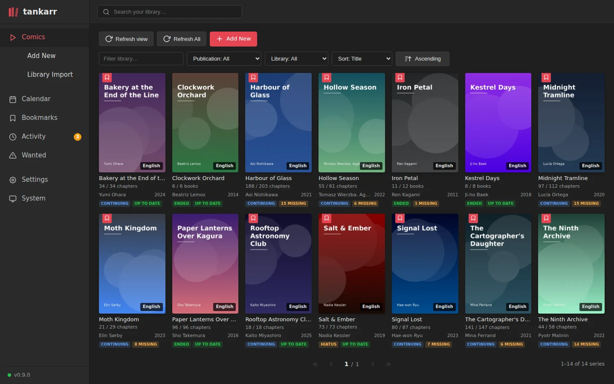
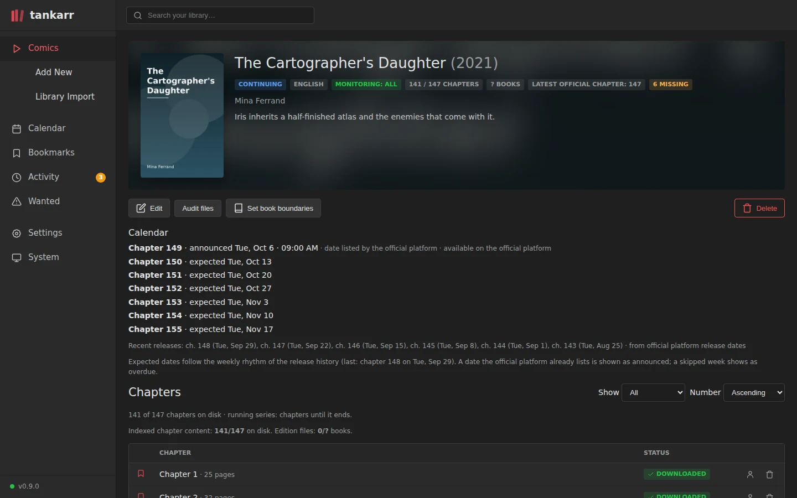
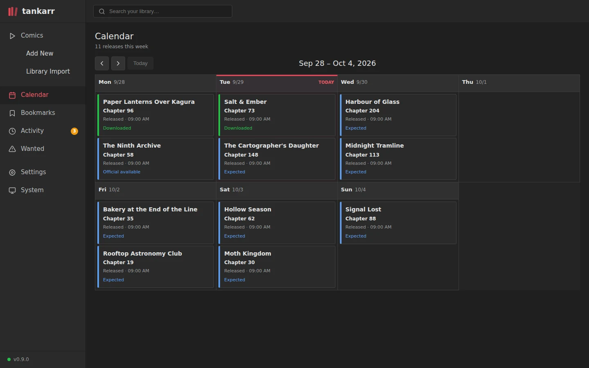
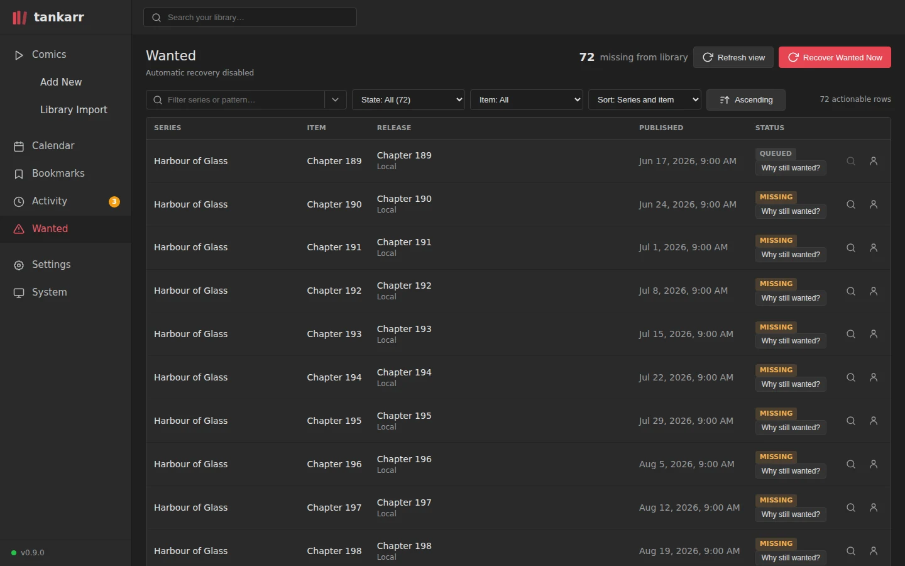
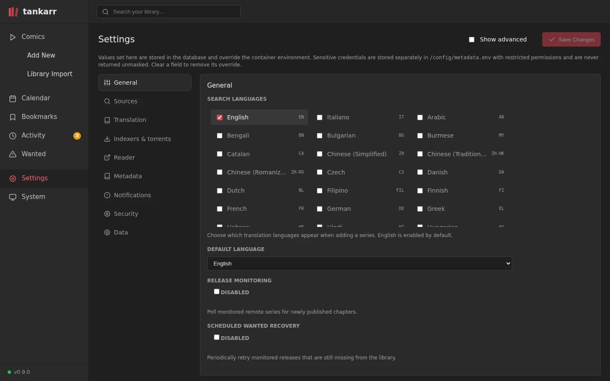
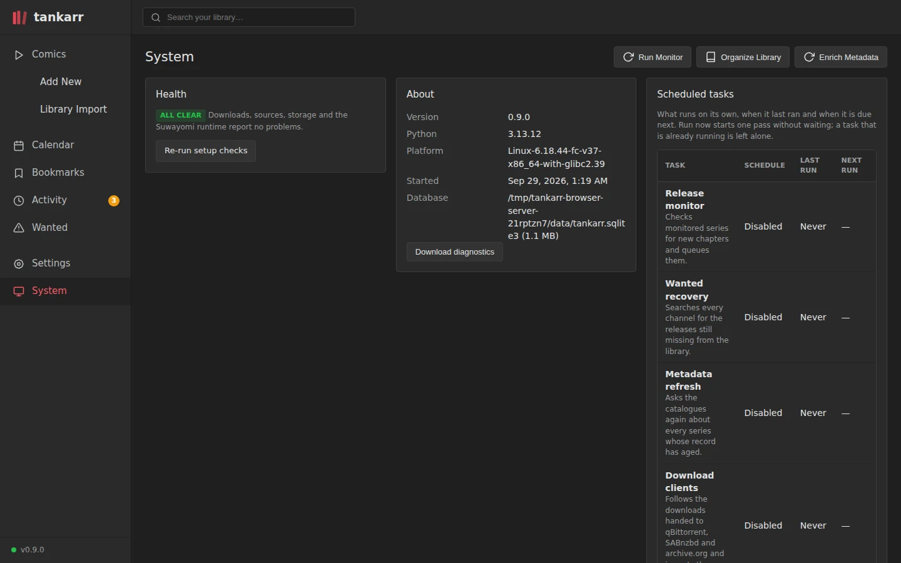

# Screenshots

Prefer to click around? The [online demo](demo/) is the same interface on a
library of well-known series, with every page and the built-in reader.

Every page follows the layout the *arr applications share, so Sonarr and
Radarr users find their way at once. The library below is fictional: the
titles, authors and covers are invented for the documentation, and the
screenshots are regenerated from that dataset (see
[Developing Tankarr](development.md#screenshots)).

## Library

Every series with its cover, language, the chapters or books on disk against
the ones the work has, and whether it is up to date. Filter by publication
status, library state or text; sort by title, year or completeness.

## Series

One work: its metadata and cover from the catalogue, the monitoring profile,
the release rhythm read from the publisher's platform with the next chapters
announced or expected, and every chapter with its file on disk.

## Calendar

The week's releases across the library: downloaded, available on the official
platform, or expected from each series' cadence.

## Wanted

Everything monitored that is still missing, with the state of the last
attempt and a "why still wanted?" explanation per row. Search interactively or
let the scheduled recovery pass work through the backlog.

## Settings

Languages, sources, indexers and download clients, readers, metadata,
notifications, security and data, all editable from the interface and
stored in the database; the container environment provides the defaults.

## System

Health checks, the scheduled tasks with **Run now**, logs, storage, backups
and the state of every integration.

